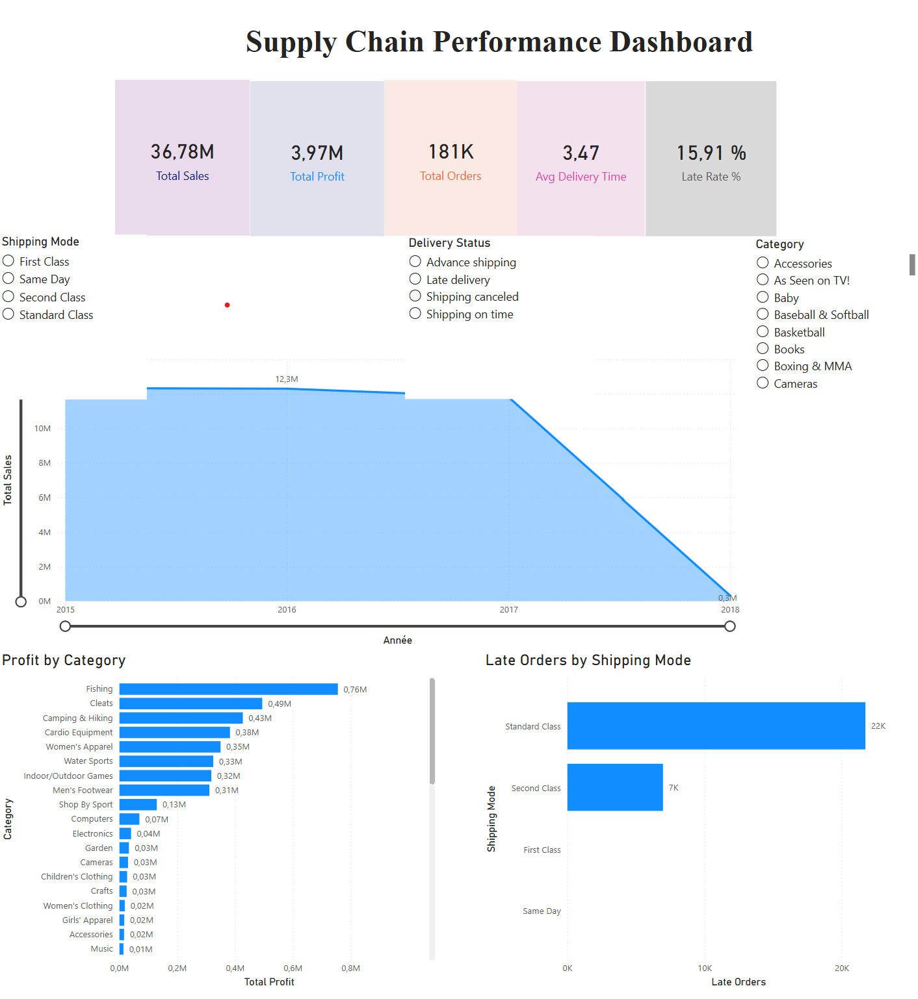
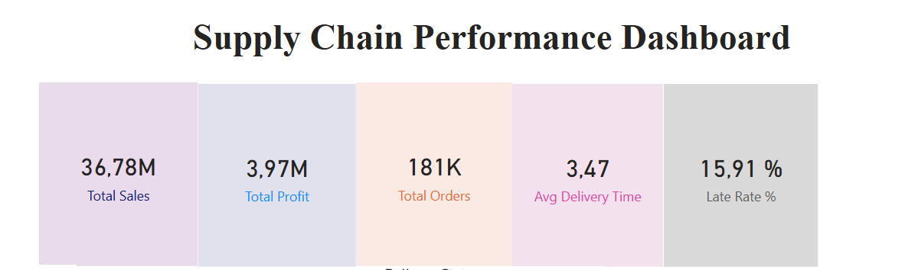
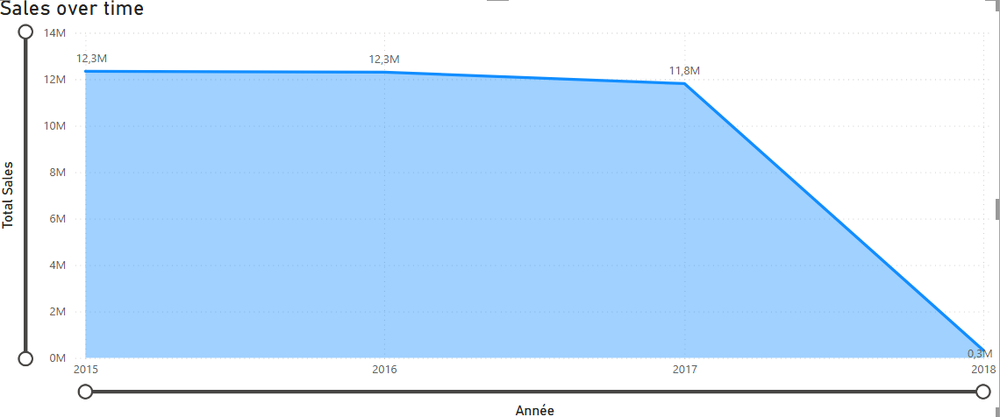
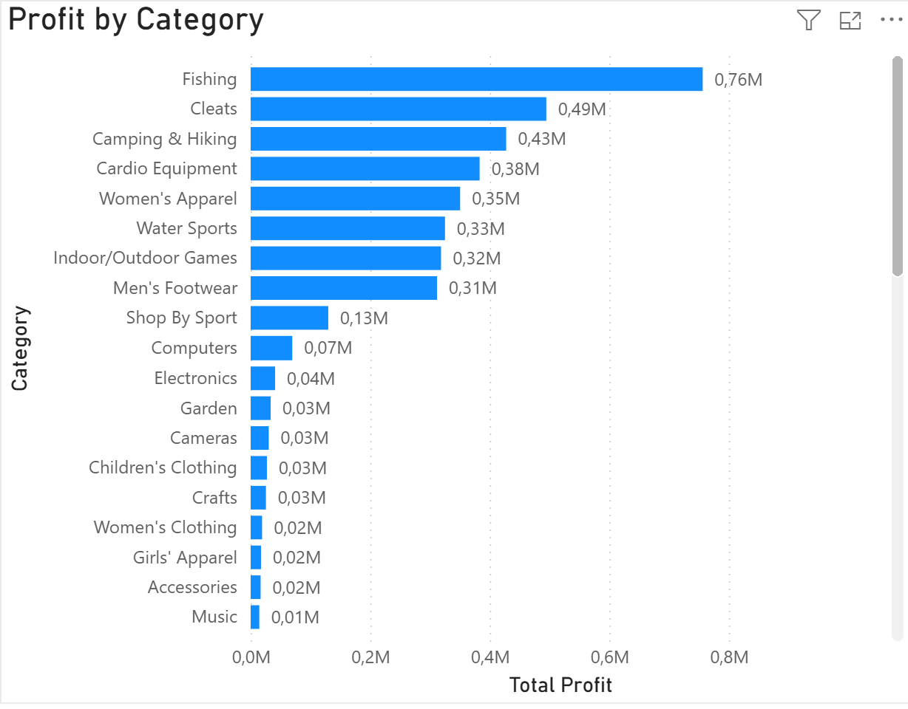
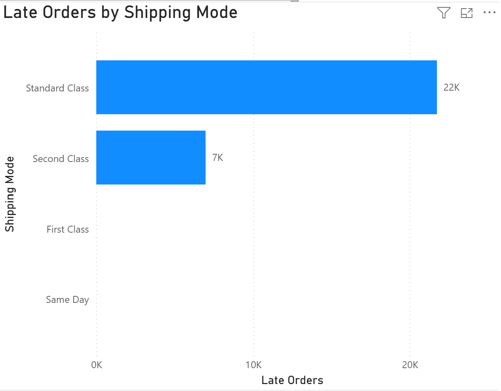

# 📊 Supply Chain Performance Dashboard – Power BI

## 🔎 Project Overview
This project presents an end-to-end Business Intelligence solution focused on **supply chain and logistics performance analysis**.

The dashboard was designed to transform raw operational data into **actionable insights**, enabling better decision-making for business and operations teams.

---

## 🎯 Objectives
- Analyze delivery performance and identify delays  
- Monitor key business metrics (sales, profit, orders)  
- Evaluate logistics efficiency by shipping mode  
- Provide a centralized and interactive dashboard for stakeholders  

---

## 🧠 Business Value
This dashboard helps answer critical operational questions:
- Which shipping modes generate the most delays?  
- How does delivery performance impact business outcomes?  
- Which product categories are the most profitable?  
- Where should operational improvements be prioritized?  

---

## 📊 Key Performance Indicators (KPIs)
- **Total Sales**  
- **Total Profit**  
- **Total Orders**  
- **Average Delivery Time**  
- **Late Delivery Rate (%)**

---

## 🛠️ Tools & Technologies
- **Power BI** (Data Visualization & Dashboarding)  
- **Power Query** (Data Cleaning & Transformation)  
- **DAX** (Measures & Business Calculations)  

---

## 📂 Dataset
The dataset used in this project is publicly available on Kaggle:

👉 https://www.kaggle.com/datasets/shashwatwork/dataco-smart-supply-chain-for-big-data-analysis

---

## 📸 Dashboard Preview

### 🌍 Global Overview

---

### 📊 KPI Summary

---

### 📈 Sales Over Time

---

### 💰 Profit by Category

---

### 🚚 Late Orders by Shipping Mode

---

## 💡 Key Insights
- Delivery delays are concentrated in specific shipping modes, indicating potential logistics inefficiencies  
- Some product categories generate high revenue but lower profitability  
- Delivery performance is a critical driver of operational efficiency  
- Data visualization significantly improves decision-making speed and clarity  

---

## 🚀 Project Highlights
- End-to-end data pipeline (cleaning → modeling → visualization)  
- Business-oriented KPIs and insights  
- Interactive dashboard with filters and drill-down capabilities  
- Focus on real-world supply chain use cases  
